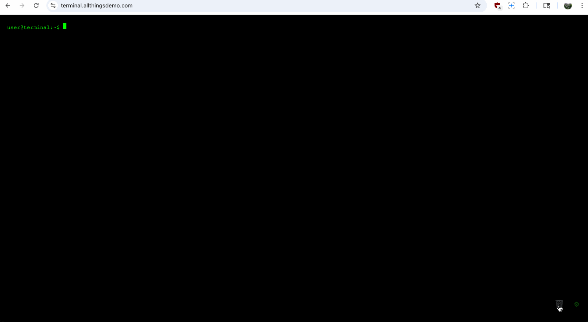

# Terminal Simulator for Interactive Demos
Simulates a shell terminal in order to create Interactive Demos.

Companies wishing to create interactive demos of their product using systems such as [Navattic.com](https://www.navattic.com) are often struggling to create more technical demonstrations, especially ones that include an shell terminal. Options exist, including Butterfly, a web-shell, but are more complicated to use.

This one page, one file terminal emulator creates a screen where you can input commands, their outputs, and the emulator will show the commands on click, just like if you were typing in a terminal.

The output is optimized for Interactive Demo creation:
- Each command+output has its own div element with a unique ID.
- Each line of output has its own div element with a unique ID.
- Users can change theme between Light/Dark.

Any commands added to the settings are saved in your local browser storage. There are no 3rd party requests, trackers, or dependencies.

## Online usage

You don't need to deploy this page yourself. This code is running the main branch on https://terminal.allthingsdemo.com - feel free to use for yourself.
